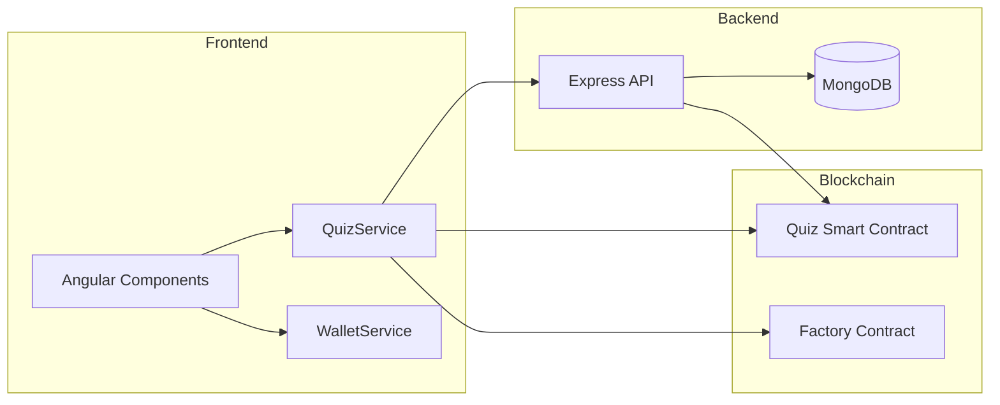
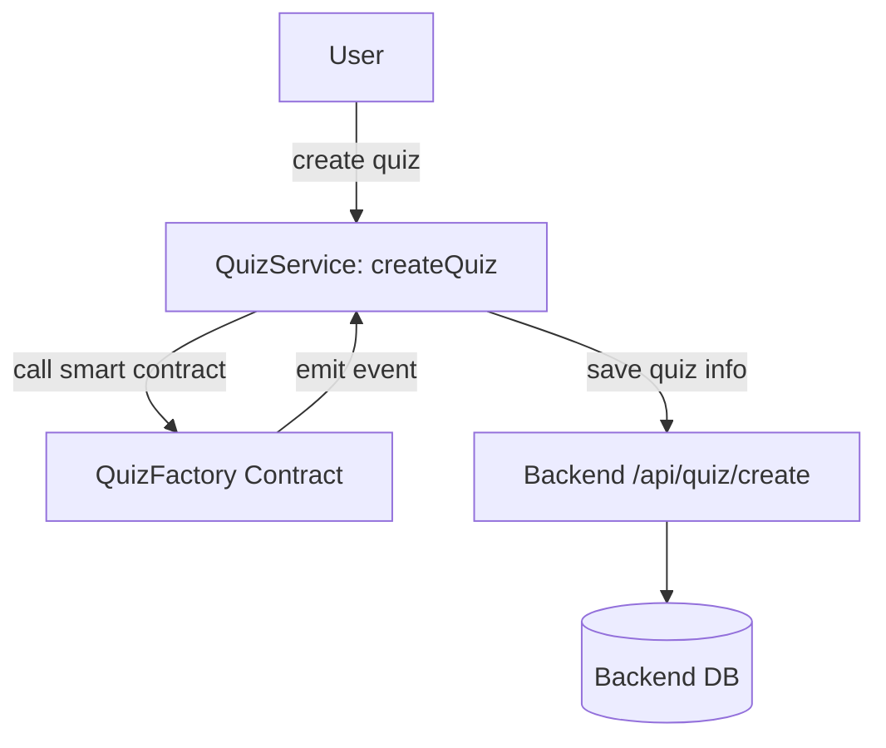
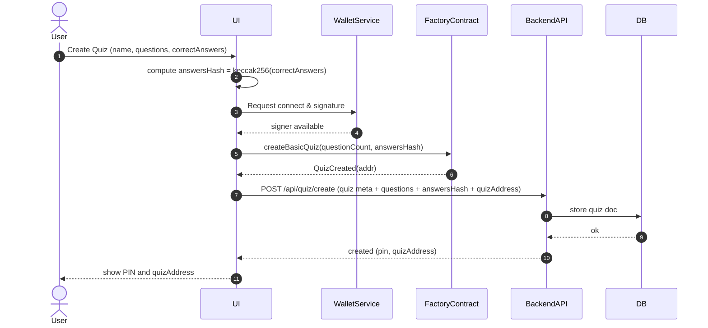
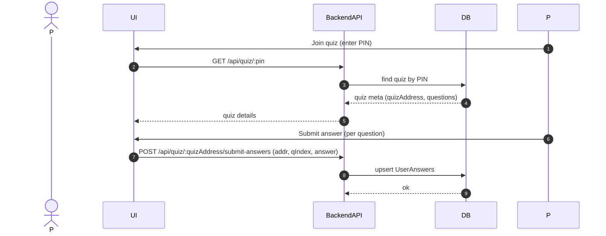
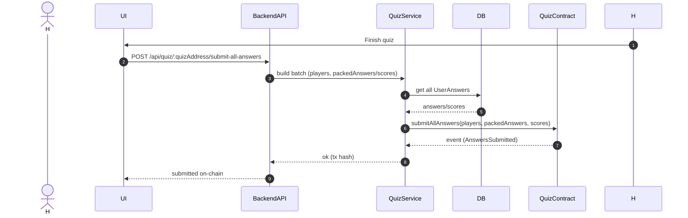
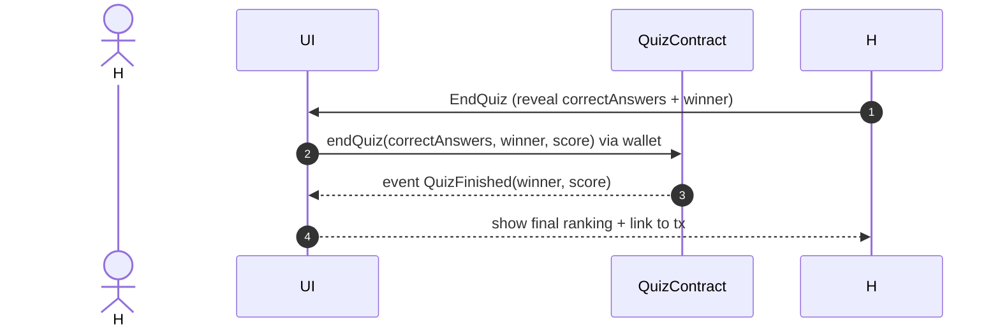

# QuizApp-Frontend

This document explains what the repository does, lists the main functions found in the frontend code (particularly smart-contract-related and the QuizService), and includes diagrams that show how pieces relate. I scanned the repository files (notably `src/services/quizContracts.service.ts` and `frontend-readme.md`) and used those sources to assemble the function list and architecture/sequence diagrams below.

---

## Summary

QuizApp-Frontend is an Angular-based decentralized quiz application (dApp) frontend. It integrates with Ethereum-compatible wallets (MetaMask), talks to a backend REST API for off-chain storage and orchestration, and interacts with on-chain smart contracts (QuizFactory and Quiz contracts) to register quizzes and anchor results.

Main parts:
- UI: Angular components (views and forms for creating/joining/taking quizzes)
- Services: WalletService (wallet & network management), QuizService (smart contract + API interactions)
- Backend API: REST endpoints for quiz metadata and user answers
- Blockchain: Factory & Quiz smart contracts (on-chain registration and finalization)

Technologies:
- TypeScript (frontend logic)
- SCSS (styles)
- HTML (templates)
- Ethers.js (contract interactions)
- Angular CLI (project scaffolding)

---

## Core smart contract methods (ABI-level)

These are the contract functions the frontend interacts with (from `quizAbi` and factory ABI extracts in `src/services/quizContracts.service.ts`):

- Factory contract
  - createBasicQuiz(uint256 questionCount, bytes32 answersHash) returns (address)
- Quiz contract
  - startQuiz(address[] _playerAddresses) — start the quiz with given players
  - submitAllAnswers(address[] players, string[] answers, uint128[] scores) — submit packed answers + scores on-chain
  - endQuiz(string correctAnswers, address _winner, uint256 _score) — conclude quiz and reveal winner
  - getQuizResults() view returns (address winnerAddress, uint256 winnerScore, uint256 totalPlayers, uint256 quizEndTime)
  - getPlayerResults(address player) view returns (string answers, uint128 score)
  - getAllPlayers() view returns (address[] memory)
  - getQuizInfo() view returns (address creatorAddress, uint256 questions, bool started, bool finished, bytes32 quizAnswersHash, address[] memory players)
  - getIsStarted() view returns (bool)

Purpose: these functions are used to create and manage on-chain quiz state and to read final results.

---

## Frontend service functions (QuizService and related)

From `src/services/quizContracts.service.ts` and project documentation, the frontend implements a QuizService that exposes methods used by UI components. Core methods found or referenced:

- createQuiz(creatorAddress: string, pin: string, ...) (or similar)
  - Creates a new quiz by calling the factory contract and then registers metadata with the backend API.
- getWinnerForQuiz(quizAddress: string)
  - Calls smart contract view `getQuizResults()` and returns winner info.
- submitAllUsersAnswersWithFrontendSigning(quizAddress: string): Promise<{ success: boolean, transactionHash?: string, winner?: { userAddress: string, score: number } }>
  - Builds a batch of user answers (from backend), signs and submits them on-chain via the Quiz contract `submitAllAnswers`, and returns transaction status and winner if available.
- getTopPlayers(quizAddress: string): Promise<{ userAddress: string, score: number }[]>
  - Reads top players / leaderboard from contract or backend aggregation (implementation reads on-chain player results or backend).
- getQuizInfo(quizAddress: string)
  - Calls contract `getQuizInfo()` and returns formatted info: creator, questionCount, isStarted, isFinished, answersHash, playerAddresses.
- getAllPlayers(quizAddress: string): Promise<string[]>
  - Calls contract `getAllPlayers()`.
- (implied) getPlayerResults(quizAddress, playerAddress)
  - Calls `getPlayerResults(player)` to obtain a player's answers and score.
- (implied) startQuiz(quizAddress, playerAddresses)
  - Triggers `startQuiz` on contract (likely a host/admin action).
- (implied) endQuiz(quizAddress, correctAnswers, winner, score)
  - Triggers `endQuiz` on contract once answers are revealed/verified.

Note: Some of these are explicit in the service file snippets; others are referenced across the repo flows and frontend-readme. If you want a complete file-level inventory (every function in every TS file), I can generate that by scanning all source files.

---

## Backend API endpoints referenced by the frontend

The frontend calls these REST endpoints (from diagrams and README excerpts):

- POST /api/quiz/create — save quiz metadata after on-chain creation
- GET /api/quiz/:pin — fetch quiz details by PIN for joining
- POST /api/quiz/:quizAddress/submit-answers — upsert per-player answers (off-chain)
- POST /api/quiz/:quizAddress/submit-all-answers — prepare and trigger on-chain batch submission of answers

---

## Diagrams (architecture, workflows, sequences)

Below are diagrams (Mermaid) describing data flow and the main sequences. You can paste these into any Markdown renderer that supports Mermaid to see the graphs.

Data Flow Diagram

Workflow: Create Quiz

Sequence: Creating a quiz (frontend + factory + backend)

Sequence: Joining and submitting answers (off-chain collection)

Sequence: Batch submission on-chain (host/admin)

Sequence: Ending the quiz and revealing winner

---

## How functions map to UI actions

- UI: "Create quiz" -> QuizService.createQuiz -> Factory.createBasicQuiz -> API POST /api/quiz/create
- UI: "Join quiz" -> API GET /api/quiz/:pin -> UI renders questions
- UI: "Submit answer" -> API POST /api/quiz/:quizAddress/submit-answers (off-chain)
- Host: "Submit all answers" -> API POST /api/quiz/:quizAddress/submit-all-answers -> QuizService.submitAllUsersAnswersWithFrontendSigning -> Quiz.submitAllAnswers (on-chain)
- Host: "End quiz" -> wallet-signed call to Quiz.endQuiz -> event QuizFinished -> UI shows results

---
