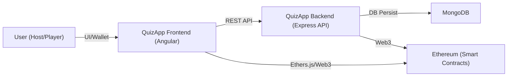
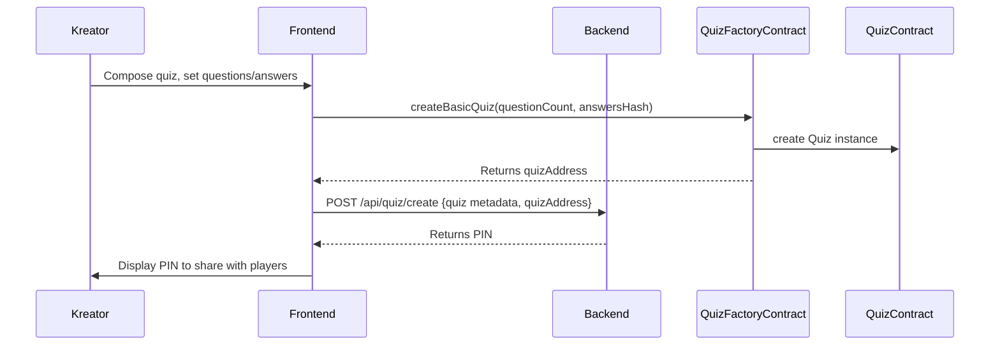
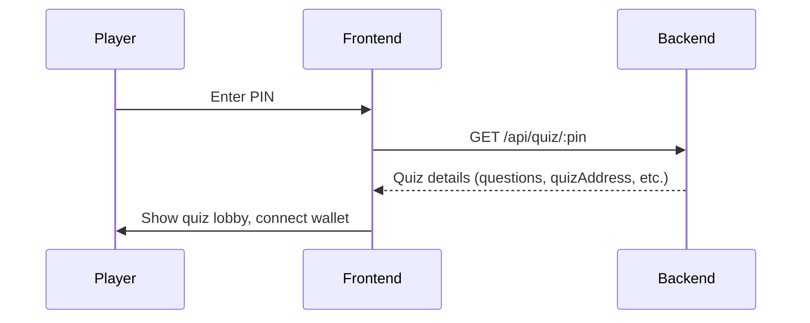
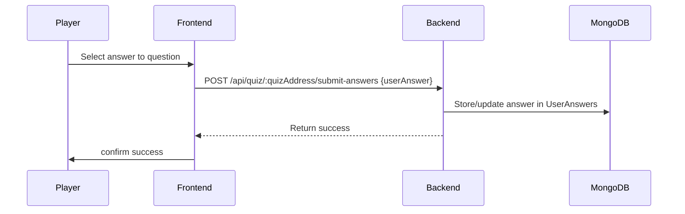
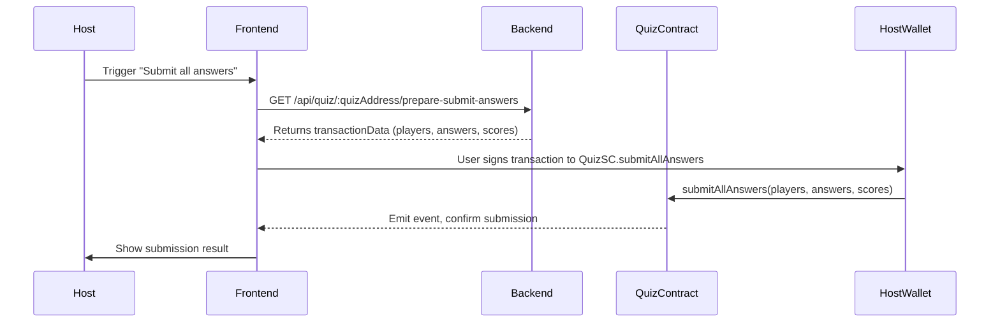
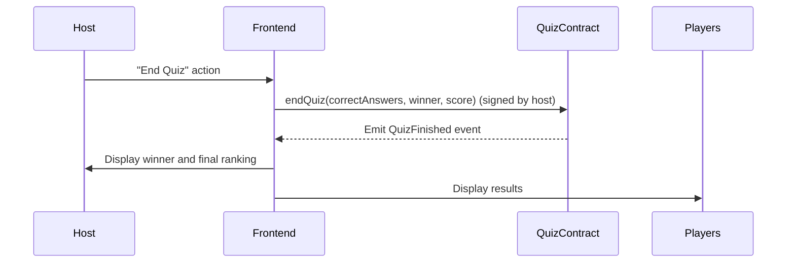

# QuizApp Frontend (QuizApp-Frontend)

This repository contains the **Angular frontend** for **QuizApp**, a decentralized quiz application (dApp). QuizApp combines:

- **Frontend:** Angular app (this repo) for creating, joining, and running quizzes
- **Backend:** Node.js + TypeScript Express API that stores quiz metadata and player answers in MongoDB, aggregates results, and prepares on-chain submissions
- **Blockchain:** Solidity smart contracts that manage the on-chain quiz lifecycle and anchor final results for transparency

This README is written for two audiences:

- **End users (players & hosts)** who want to understand how the app works end-to-end
- **Developers** who want to run, test, or extend the frontend and understand how it interacts with the backend + contracts

---

## Quick overview (high level)

- Hosts create quizzes in the UI, deploy a quiz contract via the **Factory** contract, then save quiz metadata to the backend to obtain a **PIN**.
- Players join using the **PIN**, connect a wallet (e.g., MetaMask), and submit answers **off-chain** to the backend during play.
- After play, answers/scores are **batch-submitted on-chain** (preferably by having the host sign in the frontend).
- The host ends the quiz on-chain, and the frontend displays final results while the blockchain acts as the public source of truth for the final outcome.

---

## System architecture

```mermaid
flowchart LR
    User["User (Host/Player)"]
    Frontend["QuizApp Frontend (Angular)"]
    Backend["QuizApp Backend (Express API)"]
    DB["MongoDB"]
    Ethereum["Ethereum (Smart Contracts)"]

    User -- "UI/Wallet" --> Frontend
    Frontend -- "REST API" --> Backend
    Backend -- "DB Persist" --> DB
    Backend -- "Web3" --> Ethereum
    Frontend -- "Ethers.js/Web3" --> Ethereum
```

**Frontend:** Angular app for end-users and hosts  
**Backend:** Express API that stores and aggregates off-chain data and prepares on-chain transactions  
**Smart Contracts:** Solidity contracts for quiz lifecycle, answer submission, and prize distribution

---

## What makes QuizApp different

- **Decentralized final result anchoring:** final results (winner/score) are recorded on-chain for transparency.
- **Off-chain convenience:** answers are collected off-chain during play to reduce gas costs and friction.
- **Wallet-based ownership:** blockchain actions are signed with wallets (MetaMask), keeping custody with users.

---

## Main flows & sequence diagrams

### 1) Creating a quiz (host)

```mermaid
sequenceDiagram
    participant Kreator
    participant Frontend
    participant Backend
    participant FactorySC as QuizFactoryContract
    participant QuizSC as QuizContract

    Kreator->>Frontend: Compose quiz, set questions/answers
    Frontend->>FactorySC: createBasicQuiz(questionCount, answersHash)
    FactorySC->>QuizSC: create Quiz instance
    FactorySC-->>Frontend: Returns quizAddress
    Frontend->>Backend: POST /api/quiz/create {quiz metadata, quizAddress}
    Backend-->>Frontend: Returns PIN
    Frontend->>Kreator: Display PIN to share with players
```

**What happens conceptually:**
- Host composes quiz questions and correct answers in the frontend.
- Frontend computes an **answers hash** (keccak256) and deploys a new quiz instance on-chain via `QuizFactory`.
- Frontend then persists quiz metadata to the backend, which returns a **PIN** used for joining.

---

### 2) Joining a quiz (player)

```mermaid
sequenceDiagram
    participant Player
    participant Frontend
    participant Backend

    Player->>Frontend: Enter PIN
    Frontend->>Backend: GET /api/quiz/:pin
    Backend-->>Frontend: Quiz details (questions, quizAddress, etc.)
    Frontend->>Player: Show quiz lobby, connect wallet
```

**What happens conceptually:**
- Players enter a PIN in the UI.
- The frontend fetches quiz details from the backend, then prompts players to connect their wallet.

---

### 3) Submitting answers (during play)

```mermaid
sequenceDiagram
    participant Player
    participant Frontend
    participant Backend
    participant DB as MongoDB

    Player->>Frontend: Select answer to question
    Frontend->>Backend: POST /api/quiz/:quizAddress/submit-answers {userAnswer}
    Backend->>DB: Store/update answer in UserAnswers
    Backend-->>Frontend: Return success
    Frontend->>Player: confirm success
```

**What happens conceptually:**
- Player answers are submitted **off-chain** to the backend per question.
- The backend stores/upserts answers in MongoDB.

---

### 4) Submitting all answers on-chain (host/admin)

```mermaid
sequenceDiagram
    participant Host
    participant Frontend
    participant Backend
    participant QuizSC as QuizContract
    participant Wallet as HostWallet

    Host->>Frontend: Trigger "Submit all answers"
    Frontend->>Backend: GET /api/quiz/:quizAddress/prepare-submit-answers
    Backend-->>Frontend: Returns transactionData (players, answers, scores)
    Frontend->>Wallet: User signs transaction to QuizSC.submitAllAnswers
    Wallet->>QuizSC: submitAllAnswers(players, answers, scores)
    QuizSC-->>Frontend: Emit event, confirm submission
    Frontend->>Host: Show submission result
```

**What happens conceptually:**
- Backend aggregates answers/scores into arrays and prepares the data needed for a single batched on-chain submission.
- Preferred decentralization path: **backend prepares**, **host signs** the transaction in the frontend.

---

### 5) Ending the quiz & revealing the winner (host)

```mermaid
sequenceDiagram
    participant Host
    participant Frontend
    participant QuizSC as QuizContract

    Host->>Frontend: "End Quiz" action
    Frontend->>QuizSC: endQuiz(correctAnswers, winner, score) (signed by host)
    QuizSC-->>Frontend: Emit QuizFinished event
    Frontend->>Host: Display winner and final ranking
    Frontend->>Players: Display results
```

**What happens conceptually:**
- Host calls `endQuiz(...)` from their wallet.
- Contract emits an event; frontend listens and shows final ranking + (optionally) a transaction link.

---

## Key UI actions mapped to system calls

- **Create quiz** → Frontend `QuizService.createQuiz` → `QuizFactory.createBasicQuiz` → Backend `POST /api/quiz/create`
- **Join quiz** → Backend `GET /api/quiz/:pin` → show questions / lobby
- **Submit answer** → Backend `POST /api/quiz/:quizAddress/submit-answers`
- **Submit all answers (host)** → Backend `GET /api/quiz/:quizAddress/prepare-submit-answers` → Frontend signs → `Quiz.submitAllAnswers` (on-chain)
- **End quiz** → wallet-signed `Quiz.endQuiz` → show results

---

## Smart contract summary (for users & integrators)

Main contracts and common functions the frontend interacts with (via Ethers.js/Web3):

### QuizFactory
- `createBasicQuiz(uint256 questionCount, bytes32 answersHash) → returns new quiz address`
- `createPaidQuiz(uint256 questionCount, bytes32 answersHash, uint256 entryFee)`

### Quiz (basic)
- `startQuiz(address[] _playerAddresses)`
- `submitAllAnswers(address[] players, string[] answers, uint128[] scores)`
- `endQuiz(string correctAnswers, address _winner, uint256 _score)`
- `getQuizResults() view → (winnerAddress, winnerScore, totalPlayers, quizEndTime)`
- `getPlayerResults(address player) view → (answers, score)`
- `getAllPlayers() view → address[]`
- `getQuizInfo() view → (creatorAddress, questions, started, finished, quizAnswersHash, players)`
- `getIsStarted() view → bool`

### QuizWithFee (paid quizzes)
- `joinQuiz() payable`
- `startQuiz()`, `endQuiz()`, `getQuizResults()`, plus prize distribution behavior

**Notes**
- Correct answers are committed via a hash at creation time to reduce cheating.
- The system uses **batch submission** to reduce gas.
- Paid quizzes can support prize splitting (example: winner/creator/platform).

---

## Backend API endpoints (used by the frontend)

Canonical endpoints (check backend code for exact routes and auth requirements):

- `POST /api/quiz/create`
  - Create and save quiz metadata after on-chain creation  
  - Example body: `{ quizName, questions, answersHash, quizAddress, creatorAddress }`

- `GET /api/quiz/:pin`
  - Get quiz details by PIN (used for joining)

- `POST /api/quiz/:quizAddress/submit-answers`
  - Submit or upsert a single player's answer (off-chain)  
  - Example body: `{ playerAddress, qIndex, answer }`

- `GET /api/quiz/:quizAddress/prepare-submit-answers`
  - Prepare transaction data for the host to sign (preferred)

- `POST /api/quiz/:quizAddress/submit-all-answers`
  - Trigger batched submission flow (may exist depending on backend mode)

- `POST /api/quiz/:pin/end`
  - (Optional) End a quiz and persist winner in the database

---

## For players — step-by-step

1. Install MetaMask (or another wallet) and connect to the network QuizApp uses (e.g., Polygon Amoy testnet may be supported).
2. Open the app and choose **Join Quiz**.
3. Enter the **PIN** provided by the host.
4. Connect your wallet when prompted.
5. Answer questions and submit; answers go to the backend during play.
6. After the host submits results on-chain and ends the quiz, view your score and ranking.

---

## For hosts — running a quiz

1. Create a quiz in the frontend: enter questions and correct answers.
2. Connect your wallet and deploy a quiz via the Factory contract (handled by the UI).
3. Share the generated **PIN** with players.
4. After play: trigger **Submit all answers** to batch-submit results on-chain (prefer host signing via frontend).
5. End quiz by calling `endQuiz(...)` to reveal correct answers and finalize the winner.

---

## Developer setup (local dev / testing)

> See repo READMEs across frontend/backend/contracts for complete details. Summary below.

### Prerequisites
- Node.js (recommended 16–20)
- npm / yarn / pnpm
- MongoDB (local or Atlas)
- Hardhat (contracts) and an Ethereum RPC provider (Infura/Alchemy) for deployed tests
- MetaMask for frontend wallet interactions

### Frontend (Angular)
- Install dependencies: `npm install`
- Run dev server: `npm run start` (or `ng serve`)
- Configure environment: set backend API base URL in `environment.ts` to your running backend

### Backend (Node + Express + MongoDB)
- Install: `npm install`
- `.env` example variables:
  - `PORT=4000`
  - `MONGODB_URI=mongodb://localhost:27017/quizapp`
  - `ETH_PROVIDER_URL=https://YOUR_RPC_PROVIDER`
  - `CONTRACT_ADDRESS=0x...`
  - `PRIVATE_KEY=(optional; avoid in production)`
- Run: `npm run dev`
- Ensure MongoDB is reachable

### Contracts (Hardhat)
- Install: `npm install`
- Compile: `npx hardhat compile`
- Test: `npx hardhat test`
- Local deploy: `npx hardhat node` then `npx hardhat run scripts/deploy.js --network localhost`

**Signing pattern note**
- Preferred: backend prepares tx data; host signs in frontend (non-custodial).
- Alternative: backend signs with a server key (custodial) — use only in controlled environments with secure key management.

---

## Security & privacy notes

- **Wallet control:** users sign on-chain transactions with their wallet; never share private keys.
- **Off-chain answers:** stored in backend during play; final authoritative result should be anchored on-chain.
- **Sensitive keys:** do not store plaintext private keys in repos; use a secret manager.
- **Network & fees:** on-chain operations require gas; on testnets ensure you have test funds.

---

## Troubleshooting / FAQ

- **Wallet won't connect:** ensure MetaMask is installed, unlocked, and on the correct network.
- **PIN not found:** confirm the host created the quiz successfully and the backend is reachable.
- **Transaction fails when submitting/ending:** check gas, RPC provider health, and contract addresses.
- **Backend errors during aggregation:** check backend logs, DB connectivity, and that player answers exist.

---

## Glossary

- **dApp:** Decentralized application interacting with blockchain networks
- **keccak256:** hashing function used to commit correct answers
- **PIN:** short code generated by backend to join a quiz
- **Batch submission:** sending many answers/scores in one on-chain transaction to reduce gas

---

## Contributing & contact

- Report issues or feature requests via the repository issues page.
- Maintainer: **ian12-21** (GitHub)
- Workflow: fork → branch → PR, and include tests for new logic when applicable

Thanks for using QuizApp — a transparent, wallet-powered way to host & play quizzes!
