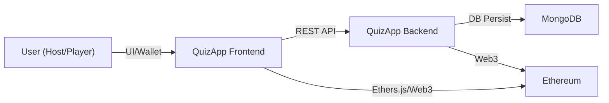
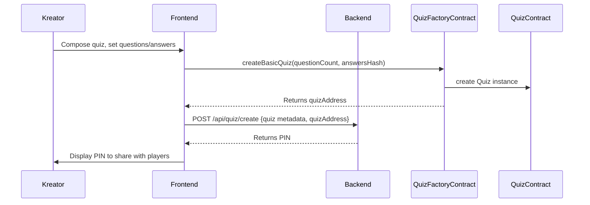
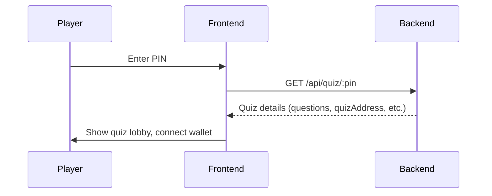
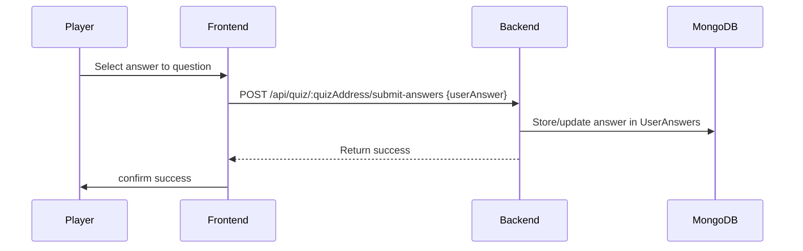
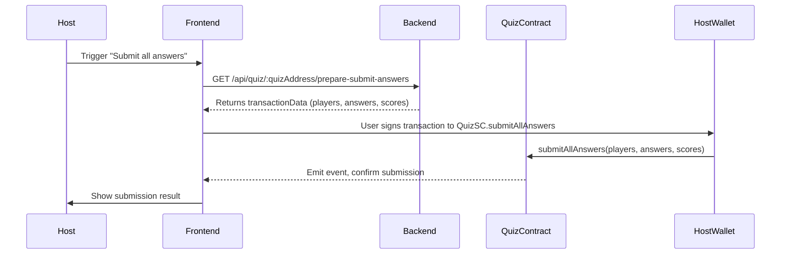
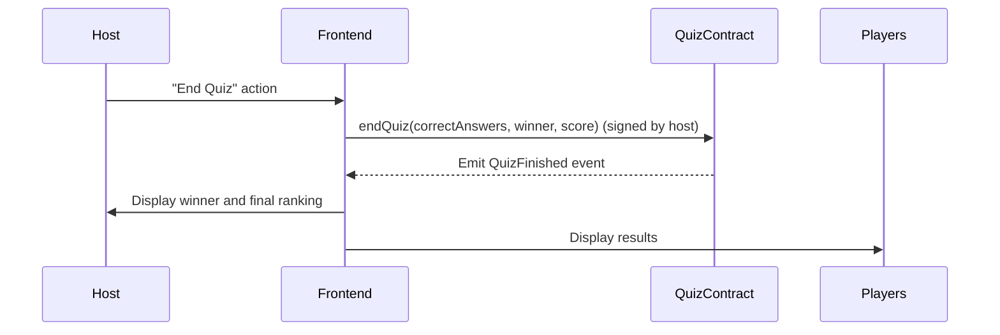

# QuizApp-Frontend

This is the frontend for **QuizApp**, a decentralized quiz platform that combines an Angular web frontend, a TypeScript/Node backend, and Ethereum smart contracts. It provides a secure, transparent, and interactive environment for quiz creation, participation, answer submission, and on-chain result anchoring.

---

## System Architecture

**Frontend:** Angular app for end-users and hosts  
**Backend:** Express API, aggregates quiz data and prepares on-chain transactions  
**Smart Contracts:** Solidity contracts for quiz lifecycle, answer storage, and prize distribution

---

## Main Flows & Sequence Diagrams

### 1. Creating a Quiz

### 2. Joining a Quiz

### 3. Submitting an Answer

### 4. Submitting All Answers (Host/Admin)

### 5. Ending a Quiz

---

## Backend API Endpoints

- `POST /api/quiz/create` — Create new quiz metadata (after contract deploy)
- `GET /api/quiz/:pin` — Get quiz by PIN for joining
- `POST /api/quiz/:quizAddress/submit-answers` — Submit one player's answer (off-chain)
- `POST /api/quiz/:quizAddress/submit-all-answers` — Aggregate and prepare batched on-chain answer submission
- `POST /api/quiz/:pin/end` — Optionally end quiz and persist winner

---

## Smart Contract Functions (Solidity)

- `QuizFactory.createBasicQuiz(questionCount, answersHash)`
- `Quiz.startQuiz(address[] playerAddresses)`
- `Quiz.submitAllAnswers(address[] players, string[] answers, uint128[] scores)`
- `Quiz.endQuiz(string correctAnswers, address winner, uint256 score)`
- `Quiz.getQuizResults()`, `Quiz.getPlayerResults(address player)`
- `QuizWithFee.joinQuiz()`, `QuizWithFee.startQuiz()`, `QuizWithFee.endQuiz()`

---

## System Highlights

- **Decentralized Results:** Only final scores and winners are anchored on-chain for transparency.
- **Off-chain Efficiency:** Answers are collected off-chain during play for gas savings.
- **Wallet-based Security:** All on-chain actions require wallet signatures.
- **Prize Distribution:** For paid quizzes, winner, creator, and platform get automatic payouts.

---

## Quick Reference — Flow Table

| Action                | Frontend Call                                     | Backend Endpoint / Contract Fn      |
|-----------------------|---------------------------------------------------|-------------------------------------|
| Create quiz           | QuizService.createQuiz → Factory.createBasicQuiz  | POST /api/quiz/create               |
| Join quiz             | GET /api/quiz/:pin                                |                                     |
| Submit answer         | POST /api/quiz/:quizAddress/submit-answers        |                                     |
| Submit all answers    | submitAllUsersAnswersWithFrontendSigning          | GET /api/quiz/:quizAddress/prepare-submit-answers → Quiz.submitAllAnswers |
| End quiz              | endQuiz (wallet signed)                           | Quiz.endQuiz                        |

---

## Security Notes

- Only quiz creators can start or end quizzes on-chain.
- Answers are hashed to prevent tampering.
- All critical operations require wallet signatures.

---

For more, see the full documentation in the [ABOUT.md](./ABOUT.md) and contract READMEs.
