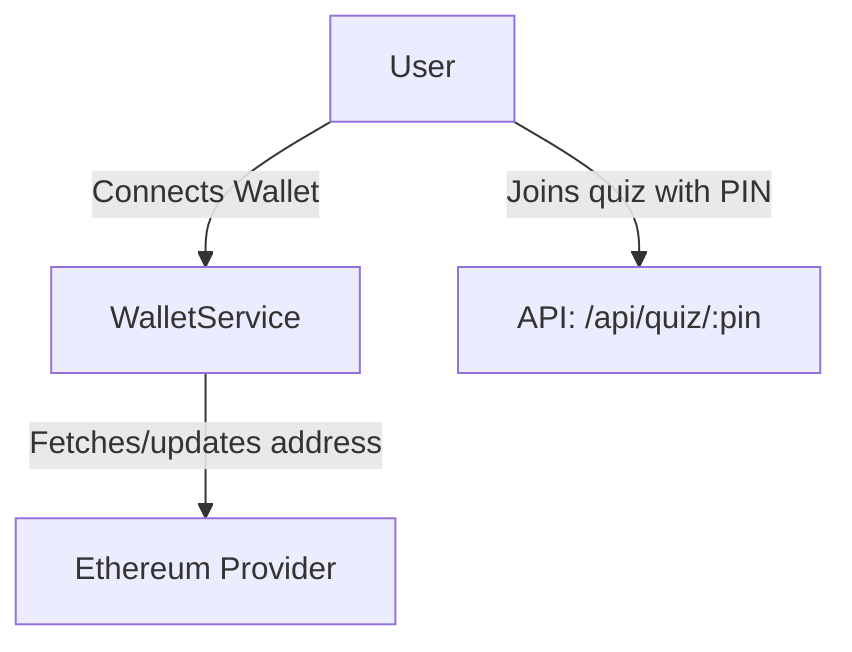
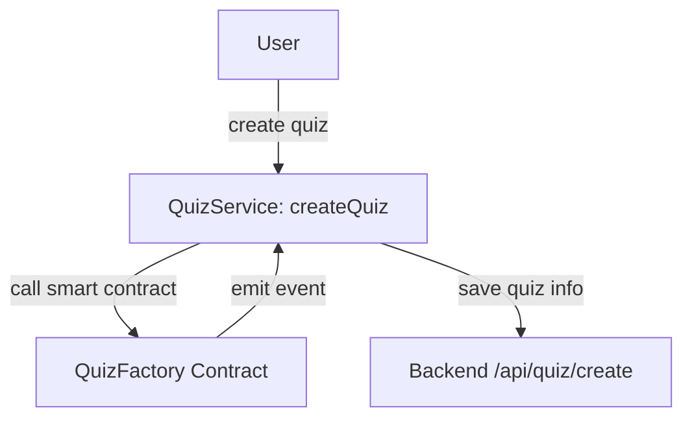
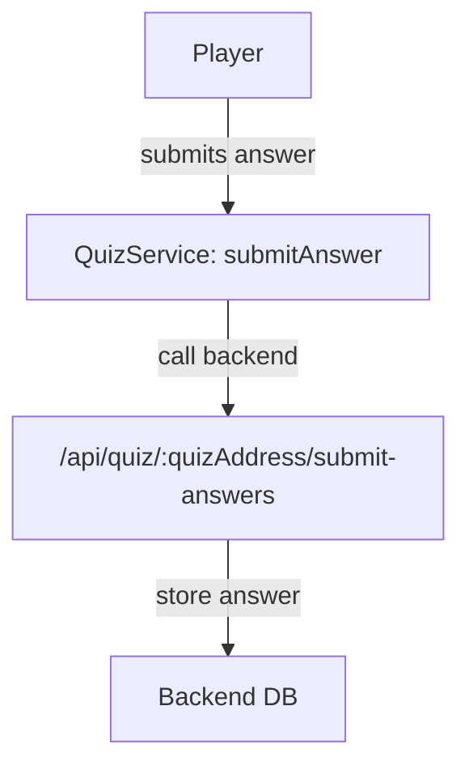
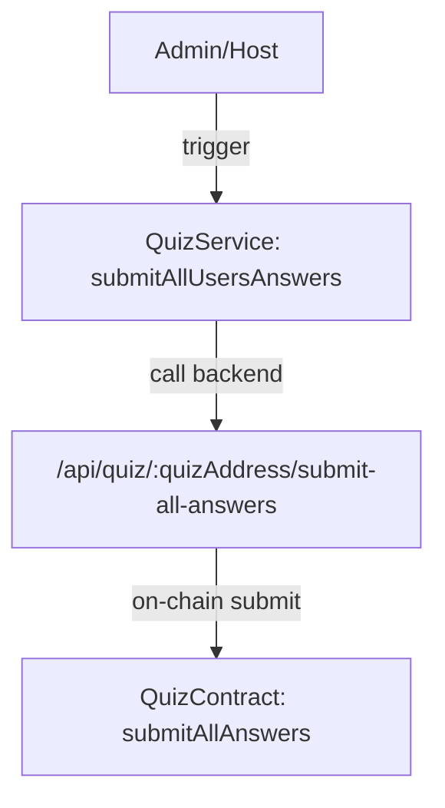
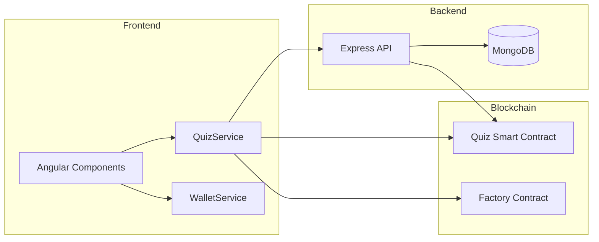

# QuizApp-Frontend: Project Overview, Architecture & Workflow

## About the Project

**QuizApp-Frontend** is a decentralized application (dApp) built using Angular, designed to provide an interactive, secure, and transparent platform for creating and playing quizzes on the blockchain. It serves as the user interface for the QuizApp ecosystem, enabling users to create, join, and participate in blockchain-powered quizzes with seamless wallet integration and real-time smart contract interaction.

**Key Objectives:**
- Offer a fair and decentralized quiz experience powered by Ethereum smart contracts.
- Provide a user-friendly interface for both quiz creators (hosts) and participants.
- Ensure transparency, security, and data integrity by anchoring quiz results and scores on-chain.
- Integrate with MetaMask and other Ethereum-compatible wallets for authentication and signing.

---

## Core Features

- **Quiz Creation:** Users can create new quizzes, which are registered on-chain and in the backend.
- **Joining Quizzes:** Players can join quizzes using a PIN.
- **Answer Submission:** Participants submit answers, which are sent to the backend and ultimately included on-chain.
- **Smart Contract Interaction:** Directly interacts with Ethereum smart contracts to create quizzes, start/finish games, and retrieve results.
- **Wallet Integration:** Connects to MetaMask (or compatible wallets) for authentication and signing.

---

## Main Technologies

- **Angular** (TypeScript, SCSS, HTML)
- **Ethers.js** (Ethereum smart contract interaction)
- **REST API** (for backend communication)
- **MetaMask/Ethereum Wallets** (user authentication and signing)

---

## Workflow Overview

### 1. User Connects Wallet & Joins Quiz



### 2. Quiz Creation & Registration



### 3. Answer Submission



### 4. Submitting All Answers to Chain



---

## Smart Contract Methods

```typescript
// Factory contract (quiz creation)
function createBasicQuiz(uint256 questionCount, bytes32 answersHash) external returns (address);

// Quiz contract (game logic)
function startQuiz(address[] _playerAddresses) external;
function submitAllAnswers(address[] players, uint128[] answers, uint128[] scores) external;
function endQuiz(string correctAnswers, address _winner, uint256 _score) external;
function getQuizResults() external view returns (...);
```

---

## Data Flow Diagram



---

## Wallet & Network Management

- Uses `WalletService` to connect, track, and react to wallet and network changes.
- Supports Polygon Amoy Testnet and can be extended to Mainnet.
- Prompts users to switch networks if needed.

---

## Security & Decentralization Note

- All smart contract transactions are signed by the user's wallet, ensuring full user custody and security.
- The backend is trusted for storing answers and quiz data, but all critical game results and scores are anchored on-chain.

---

*For more technical details, see the [README.md](./README.md) in the repository.*
